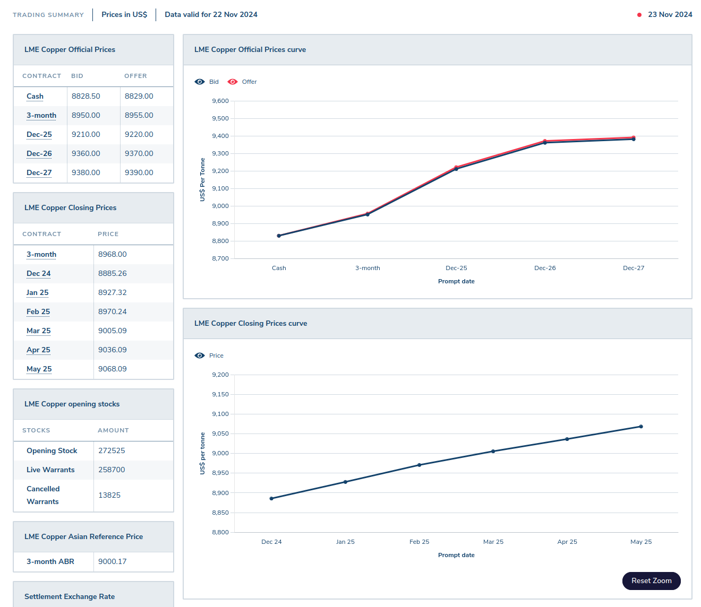
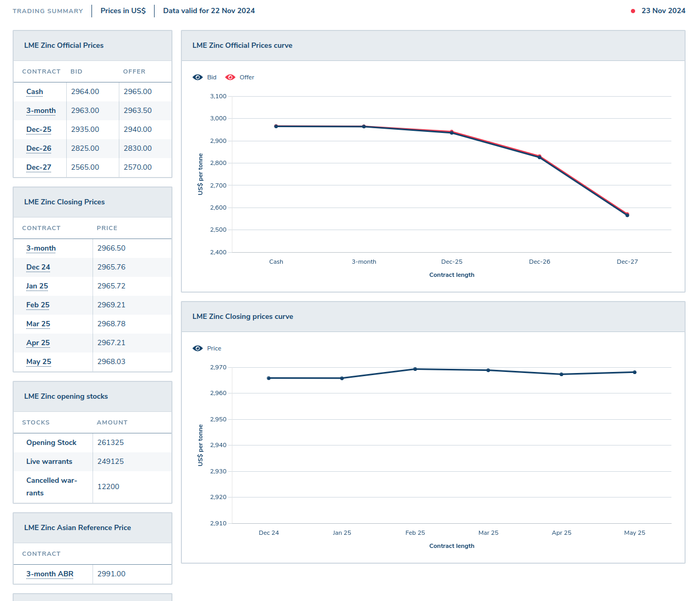

# Calculating the Value of a Brass Razoo (BRZ)

This document demonstrates how the nominal value of one BRZ is calculated, using the market data available from the London Metal Exchange (LME).

The calculation is based on the closing three-month contract price for the minerals as at the close of 22 November 2024.

*   **Copper:** US$8,968.00 per Tonne (1000 kg) [[cite:https://www.lme.com/Metals/Non-ferrous/LME-Copper#Summary]]
*   **Zinc:** US$2,966.50 per Tonne (1000 kg) [[cite:https://www.lme.com/en/Metals/Non-ferrous/LME-Zinc#Summary]]

To calculate the value of a Brass Razoo (BRZ), the contribution of each mineral is assessed based on its percentage composition:

| Mineral | US$ / Tonne | US$ / Kg | US$ / g | Mineral % | US$ Portion of Value |
| :--- | :--- | :--- | :--- | :--- | :--- |
| Copper | 8968.00 | 8.96800 | 0.00896800 | 66 | 0.00591888 |
| Zinc | 2966.50 | 2.96650 | 0.00296650 | 34 | 0.00100861 |
| **Total** | | | | **100** | **0.00692749** |

This calculation yields the following conversion values for one BRZ:

| Currency | Value | Minimum Stake Value |
| :--- | :--- | :--- |
| BRZ | 1.0 | 1,000,000.00 |
| US $ | 0.00692749 | 6,927.49 |
| EUR € | 0.006647306 | 6,647.3064 |
| GB £ | 0.005527259 | 5,527.2593 |
| JP ¥ | 1.0722277 | 1,072,227.70 |
| AU $ | 0.01065448 | 10,654.48 |

| Copper | Zinc |
| :--- | :--- |
|  |  |

# Data sources

Sellers of Brass Razoos into local currencies may reference any metals exchange they wish to calculate the local currency equevilent value of a Brass Razoo, however the seller should:
- use the same exchange for both metals (not pick prices from different exchanges for each metal)
- declare to the buyer which exchange was used for price data
- declare any currency conversion rate (and source) if the prices on the metals exchange are in a differnt currency than being used for the sale of Brass Razoos
- declare any exchange fees the seller is charging

Buyers may also reference any metals exchange they wish to calculate the local currency equevilent value of a Brass Razoo, however the must also make the same declerations as the seller (above) if attempting to negotiate the price with the seller.
