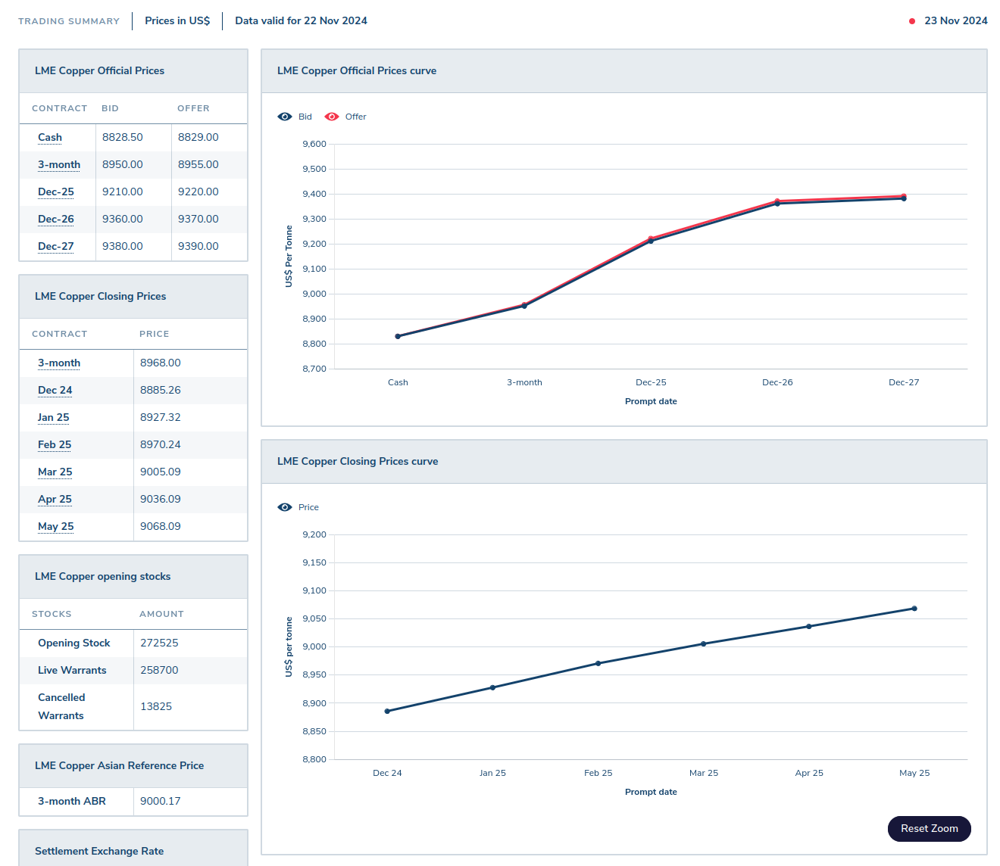
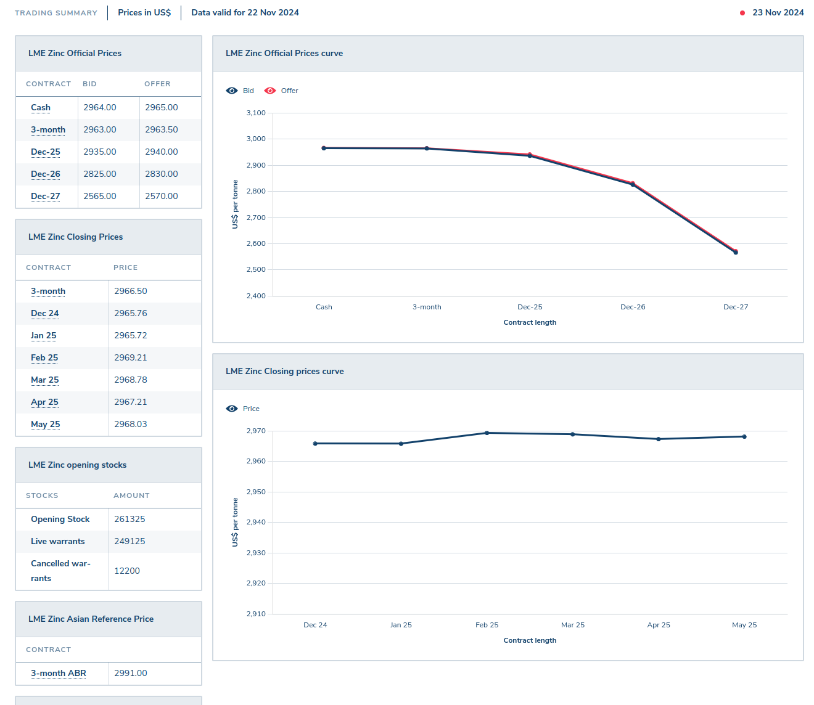

# BrassRazoo

The Brass Razoo (BRZ) is a block chain crypto currency written in python named after the slang term [_I haven't got a brass razoo_](https://en.wikipedia.org/wiki/Brass_razoo)

As such the Brass Razoo block chain intentionally has a very minimal value, however it will be a stable coin of sorts, unlike other stable coins it's not pegged to a specific currency, but rather it's nominal value will be pegged to the value of [brass](https://en.wikipedia.org/wiki/Brass). A mineral coin if you like.

1 BRZ = 1 gram of brass

[Brass](https://en.wikipedia.org/wiki/Brass) being an alloy can have varying percentages of each metal that makes up the alloy, for the purposes of determining the value of a Brass Razoo (BRZ) use the values of 66% copper and 34% zinc.

To give an example of calculating the nominal value of 1 BRZ on the 23 November 2024:

- From the London Metal Exchange (LME) we gather the price of each mineral in US$ / Tonne (1000 Kg), this calculation is using the closing 3 month contract price as at closing of the 22 Nov 2024
  - [Copper](https://www.lme.com/Metals/Non-ferrous/LME-Copper#Summary) was US$8,968.00 / Tonne
	- [Zinc](https://www.lme.com/en/Metals/Non-ferrous/LME-Zinc#Summary) was US$2,966.50 / Tonne

So to calculate the value of a Brass Razoo (BRZ):

| Mineral | US$ / Tonne | US$ / Kg | US$ / Kg | Mineral % | US$ portion of value |
|---|---|---|---|---|---|
| Copper | 8968.00 | 8.96800 | 0.00896800 | 66 | 0.00591888 |
| Zinc | 2966.50 | 2.96650 | 0.00296650 | 34 | 0.00100861 |
|  |  |  |  | Total | 0.00692749 |

This gives us values of: of 1 BRZ = US$0.0069

| Currency | Value | Example Value |
|---|---|
| BRZ | 1.0 | 1,000,000 |
| US $ | 0.00692749 | 6,927.49 |
| EUR € | 0.006647306 | 6,647.3064 |
| GB £ | 0.005527259 | 5,527.2593 |
| JP ¥ | 1.0722277 | 1,072,227.70 |
| AU $ | 0.01065448 | 10,654.48 |

| Copper | Zinc |
|---|---|
|  |  |
